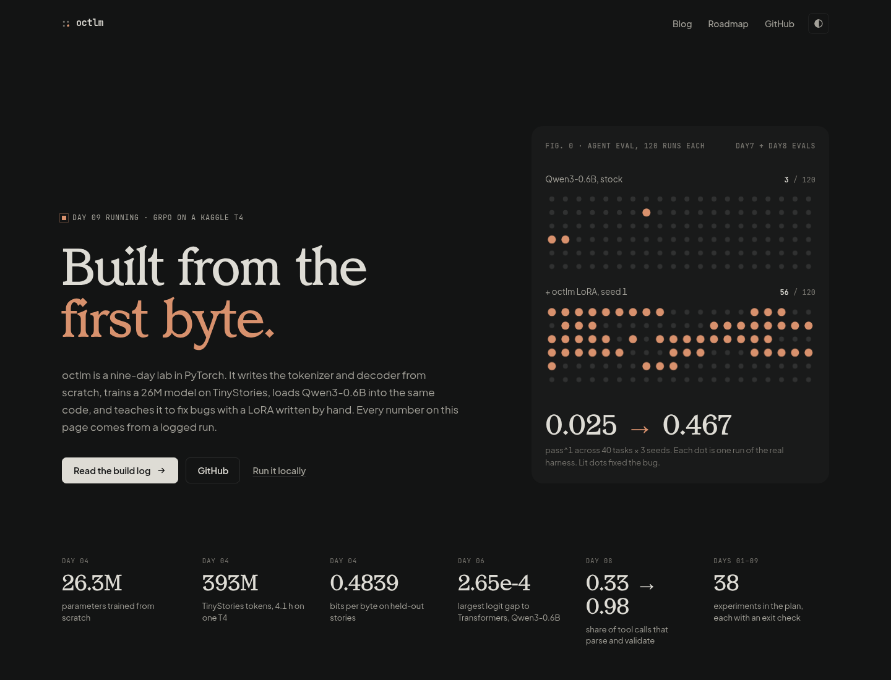
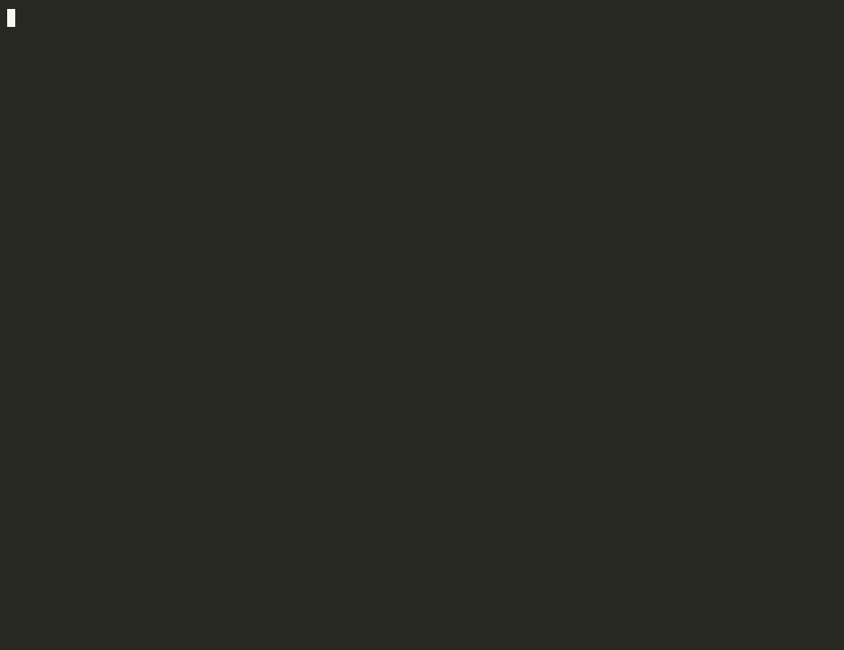
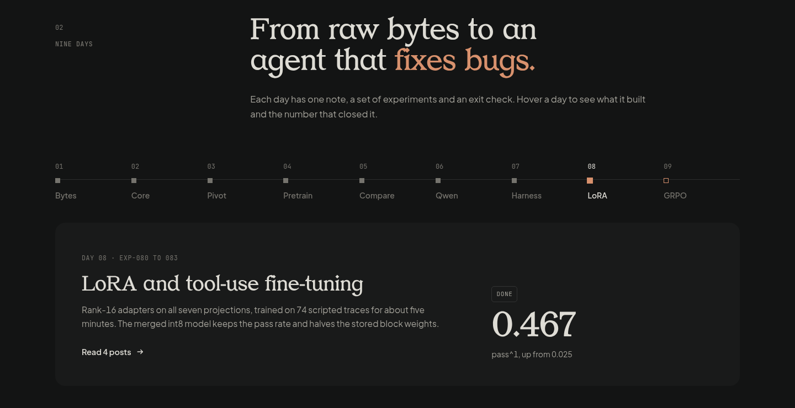
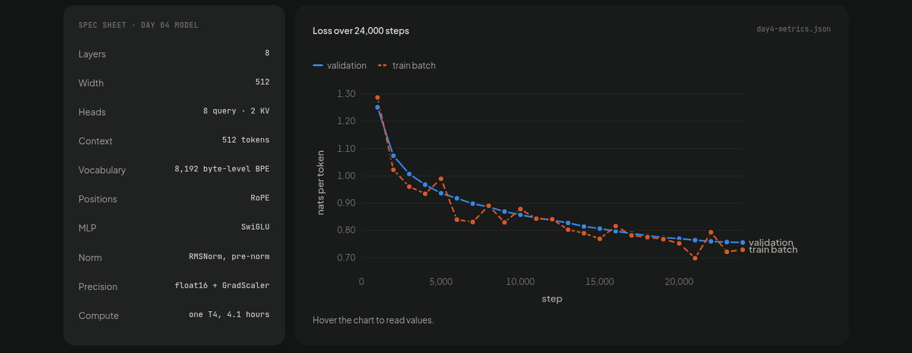
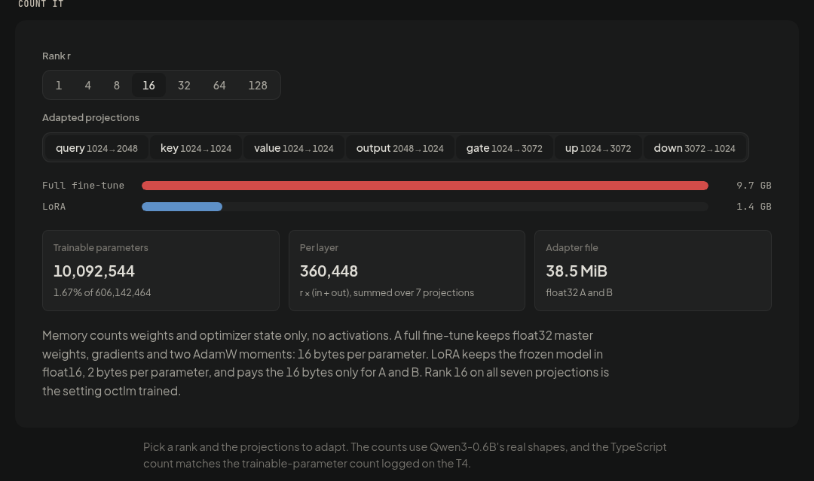

# octlm

A language model built from the first byte, in PyTorch, one measured experiment at a time.

octlm writes its own tokenizer and decoder, trains a 26M-parameter model from scratch on
TinyStories, loads Qwen3-0.6B into the same decoder, and teaches it to fix bugs with a LoRA and an
agent loop written in this repository. Every claim has a baseline, a seed spread, and a JSONL record
in `runs/`.

**[Read the build log](https://web-opal-pi-96.vercel.app)** · [Roadmap](PLAN.md) ·
[Day notes](notes/) · [Working rules](AGENTS.md)



## Results

| Day | What it built | Headline number |
| --- | --- | --- |
| 1 | Character and byte-level BPE tokenizers, a decoder, a training loop with exact resume | BPE beats characters by 15.4% in bits per byte |
| 2 | RoPE, RMSNorm, SwiGLU, grouped-query attention, SDPA, a 7 MB code and prose corpus | Flash SDPA is 10.5x faster than math at 8,192 tokens, on 84x less memory |
| 3 | Multi-token prediction, sparse, compressed, and latent attention, behind flags | Built and tested, then the plan changed. [Why](notes/day3.md) |
| 4 | A 26.3M model trained on 393M TinyStories tokens in float16 on one T4 | 0.4839 bits per byte on held-out stories |
| 5 | Three seeds per stack, multi-token prediction, a KV cache, int8 weights | `modern` beats baseline by 6.8x the seed spread. int8 is 41.7% smaller |
| 6 | Qwen3-0.6B loaded into `octlm/model.py` from raw safetensors | Logits within 2.65e-4 of Transformers, exact greedy tokens |
| 7 | A five-tool agent harness and 40 eval tasks | Stock Qwen passes 0.025 of runs |
| 8 | LoRA from scratch, 74 scripted traces, SFT, merge, int8 | pass^1 rises from 0.025 to 0.467. Valid calls rise above 0.97 |
| 9 | GRPO on the harness task checks | Running on a Kaggle T4 |

## Watch it run

Qwen3-0.6B with the Day 8 LoRA fixes a failing test through the Day 7 harness. It runs the tests,
reads the file, writes a fix, and runs the tests again.


The same task and seed without the adapter. The stock model answers without calling a tool, which
is the Day 7 failure mode.



The 26M model trained here streams a story. Each token is colored by the probability the model gave
it.


Each recording is one CPU run at seed 0 or 1. It illustrates the measured pass rates in
[`notes/day8.md`](notes/day8.md). It does not replace them. Replay the full terminal sessions with
asciinema:

```sh
asciinema play web/public/demo/agent-lora.cast
```

## The build log

[`web/`](web/) is an Astro site with 41 posts across nine days. Each post explains one idea from
zero, shows the math, gives an interactive widget, and reads its numbers from `runs/` at build time.
TypeScript ports in `web/src/lib/` pass parity tests against the Python code.







## Quick start

You need Python 3.14 (pinned in `.python-version`) and [uv](https://docs.astral.sh/uv/). `uv.lock`
pins the CPU build of PyTorch 2.14.

```sh
uv sync
uv run python -m octlm.train --config configs/day1.toml --dry-run
```

The dry run builds the model and prints its config hash, parameter count, and logits shape:

```json
{"config_sha256":"12cc0f1de67889e04411e8d5d78e62ae284318e001f7403f3c8068fb613eae5e","logits_shape":[1,128,1024],"parameters":541952,"type":"dry_run"}
```

PyTorch prints a NumPy warning on import. octlm never converts a tensor to a NumPy array, so it does
not depend on NumPy. Ignore the warning.

### Run the demos

The agent demo needs `artifacts/day6/qwen` and `artifacts/day8/adapter-0.pt`. The stories demo
needs `artifacts/day4/run.pt` and `artifacts/day4/bpe.json`.

```sh
uv run python -m octlm.demo agent                     # Qwen + LoRA on bug-low-stock
uv run python -m octlm.demo agent --base              # same task, no adapter
uv run python -m octlm.demo agent --list              # the 40 eval tasks
uv run python -m octlm.demo agent --task cart-clear
uv run python -m octlm.demo stories
uv run python -m octlm.demo stories --prompt "The dragon was tired." --temperature 1.0
```

### Run the checks

```sh
uv run python -m unittest
uv run ruff check .
uv run ruff format --check .
```

### Run the site

```sh
cd web
npm install
npm run export   # regenerate fixtures from runs/ and artifacts/
npm test         # TypeScript against Python parity tests
npm run dev
```

## How the work is run

Each experiment starts in its day note with a problem, a hypothesis, a baseline, a measurement, and
a stop condition. It ends with the result, the failures, and a keep or revert decision. A result
counts only when its gap beats the seed spread. Each design choice names the paper, model report, or
official source that caused it.

A day starts only when every exit check of the day before passes. The plan changed once, on
2026-09-23, from pretraining 50M to 150M models to the current path. [`notes/day3.md`](notes/day3.md)
records why.

## Commands by day

<details>
<summary>Day 1: tokenizers, decoder, training loop</summary>

Train both tokenizers and write them to `artifacts/day1/`:

```sh
uv run python -m octlm.tokenizer --vocab-sizes 512 1024 2048
```

Train the decoder, then memorize one fixed block to prove the model, loss, and optimizer compose:

```sh
uv run python -m octlm.train --tokenizer bpe --metrics runs/day1-bpe.jsonl
uv run python -m octlm.train --tokenizer bpe --overfit --metrics runs/day1-overfit.jsonl
```

Write a checkpoint, then resume it. The resumed run produces the same weights as an uninterrupted
run on the same machine, PyTorch build, and device:

```sh
uv run python -m octlm.train --checkpoint artifacts/day1/run.pt --stop-after 100
uv run python -m octlm.train --resume artifacts/day1/run.pt
```

Measure the forward pass at several context lengths:

```sh
uv run python -m octlm.bench --dummy --contexts 128 256 512 1024 2048
```

| Flag | Default | Effect |
| --- | --- | --- |
| `--config` | `configs/day1.toml` | Model, training, and tokenizer settings |
| `--tokenizer` | `bpe` | `bpe` or `character` |
| `--checkpoint` | none | Where to write the final checkpoint |
| `--resume` | none | Checkpoint to continue from |
| `--metrics` | none | JSONL file that receives every eval record |
| `--stop-after` | none | Stop before `training.steps` |
| `--overfit` | off | Train and validate on one block |
| `--dry-run` | off | Build the model, print the shape, exit |
| `--device` | `auto` | `auto`, `cpu`, `cuda`, or `cuda:N` |

</details>

<details>
<summary>Day 2: modern decoder core</summary>

Build the corpus. It reads the local Python standard library and downloads six public-domain books
into `data/`:

```sh
uv run python -m octlm.corpus
```

`variants` and `length` train for tens of minutes. Run them on a GPU:

```sh
uv run python -m octlm.day2 tiled         # tiled attention against SDPA
uv run python -m octlm.day2 equivalence   # SDPA against the handwritten path
uv run python -m octlm.day2 sdpa          # math against flash, memory and throughput
uv run python -m octlm.day2 cache         # KV cache bytes per head count
uv run python -m octlm.day2 variants      # the architecture grid
uv run python -m octlm.day2 length --config configs/day2-long.toml
uv run python -m octlm.day2 report
```

Eight architectures, three seeds, 400 steps each on one T4. Bits per byte on held-out code:

| Variant | Code bpb | Seed spread | Cache at 4K | Decision |
| --- | ---: | ---: | ---: | --- |
| baseline | 2.9339 | 0.0434 | 16 MiB | control |
| swiglu | 2.8521 | 0.0085 | 16 MiB | keep |
| rmsnorm | 2.9352 | 0.0390 | 16 MiB | keep only inside `modern` |
| gqa-2 | 2.9449 | 0.0235 | 4 MiB | keep, for the cache |
| post-norm | 3.9310 | 0.0047 | 16 MiB | revert |
| modern | 2.8045 | 0.1194 | 4 MiB | best measured, not separated from `swiglu` |

The baseline moves 0.043 bits per byte across seeds with nothing else changed, so SwiGLU's 0.082 is
the only single-component result outside the noise.

</details>

<details>
<summary>Day 3a: attention variants, stopped before training</summary>

```sh
uv run python -m octlm.day3 cache --config configs/day3-long.toml
uv run python -m octlm.day3 mtp --config configs/day3.toml
uv run python -m octlm.day3 sparse --config configs/day3-long.toml
uv run python -m octlm.day3 compressed --config configs/day3-long.toml
uv run python -m octlm.day3 mla --config configs/day3-long.toml
uv run python -m octlm.day3 report
```

Every Day 3a flag in `model.py` defaults off: `mtp_depth`, `attention_window`, `attention_stride`,
`kv_compress_block`, `mla_rank`, and `mla_rope_dim`.

</details>

<details>
<summary>Days 4 and 5: the 26M model, seeds, KV cache, int8</summary>

```sh
python -m octlm.day4 prepare                       # download and encode 2.2 GB of TinyStories
python -m octlm.day4 train                         # resumes from --checkpoint when it exists
python -m octlm.day4 samples --temperature 0
python -m octlm.day4 samples                       # temperature 0.8, top-k 40

python -m octlm.day5 spread                        # three seeds per stack
python -m octlm.day5 mtp
python -m octlm.day5 cache
python -m octlm.day5 quant
```

The KV cache matches naive greedy output token for token and decodes 10.6 to 15.8 percent faster.
int8 weights cut the inference checkpoint from 52.5 MB to 30.7 MB, change bits per byte by
+0.00003, and decode 20 percent slower. Float16 stays the default.

</details>

<details>
<summary>Days 6 to 9: Qwen, the harness, LoRA, GRPO</summary>

```sh
python -m octlm.day6 prepare                       # pinned Qwen3-0.6B snapshot with hashes
python -m octlm.day6 run                           # logit, tokenizer, and template parity

python -m octlm.harness validate                   # each check fails before and passes after the fix
python -m octlm.harness eval --seeds 0 1 2         # 40 tasks, writes JSONL

python -m octlm.day8 traces
python -m octlm.day8 train --seed 0
python -m octlm.day8 eval --adapter artifacts/day8/adapter-0.pt
python -m octlm.day8 eval --adapter artifacts/day8/adapter-0.pt --int8

python -m octlm.day9 probe
python -m octlm.day9 train
```

</details>

## Run on a GPU

The development laptop has no GPU and overheats under long runs, so training runs on Colab and
Kaggle T4s. Each day that trains has a notebook in [`notebooks/`](notebooks/). The notebooks use the
preinstalled CUDA PyTorch. Do not run `uv sync` there, because `uv.lock` pins the CPU build.
`--device auto` takes the GPU when there is one, and each training record names the device it ran
on.

<details>
<summary>Run a notebook on Kaggle</summary>

1. Create a private Kaggle dataset named `octlm-code` with the repository files at its root. For a
   private repository, run `git archive --format=zip --output=octlm-code.zip HEAD` and upload the
   ZIP.
2. Import the notebook, for example [`octlm-kaggle.ipynb`](notebooks/octlm-kaggle.ipynb). Add
   `octlm-code` under **Input**. Select **GPU T4 x2** under **Session options**. Turn on
   **Internet** for the first run.
3. Select **Save Version > Save & Run All**.
4. Download the outputs from the version's **Output**. To resume, add that output as an **Input**
   and set `PREVIOUS` to the attached `day4` folder. The trainer checks the config, tokenizer, and
   token-file hashes before it resumes.

</details>

## Repository layout

```text
octlm/
  config.py      TOML settings, validation, SHA-256 fingerprint
  tokenizer.py   character and byte-level BPE tokenizers
  model.py       the decoder, every architecture switch, Qwen3 weights
  train.py       training loop, atomic checkpoints, exact resume
  bench.py       forward-pass measurement, the octlm-bench-v1 schema
  corpus.py      Day 2 code and prose corpus with hashes and licenses
  day2.py ... day9.py   one module of experiment stages per day
  harness.py     tool-call parser, agent loop, task checks, pass^k
  demo.py        the live agent and stories demos
configs/         one TOML per day
fixtures/        Day 7 eval tasks, Day 8 SFT and GRPO tasks
notebooks/       Colab and Kaggle runs
notes/           one note per day: sources, decisions, measurements, failures
runs/            JSONL records from every measured run
tests/           unittest suites
web/             the Astro build log
```

Both tokenizers preserve input bytes exactly. BPE learns merges from training data only, breaks
ties by token ID, and never merges across a pre-token boundary. Ordinary text that contains
`<|tool_call|>` encodes as literal characters. Every checkpoint stores the config, tokenizer, and
dataset hashes, and a resume with a mismatched hash fails.

## Contribute

Read [`PLAN.md`](PLAN.md), [`AGENTS.md`](AGENTS.md), and every completed note before you change
code. Take the lowest unfinished experiment. Write the hypothesis and baseline into the day note
first, then implement, measure, and record keep or revert.
